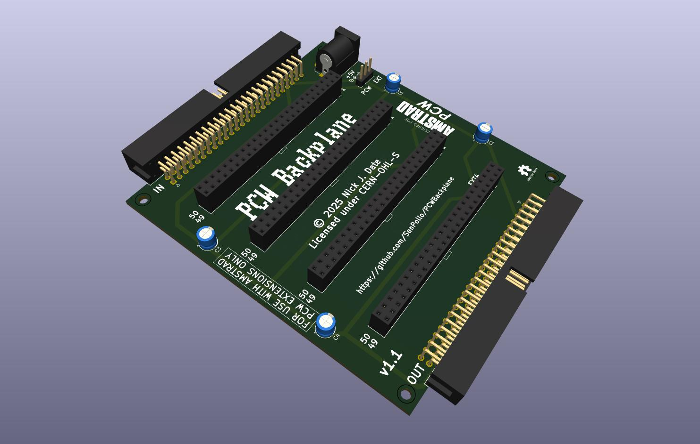
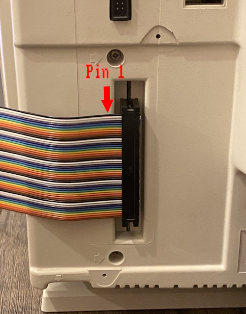
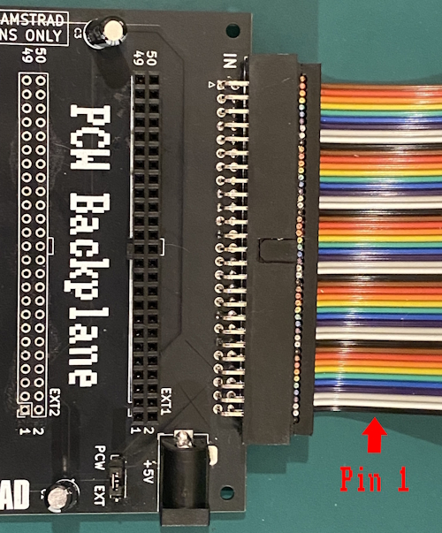

# PCW Backplane

1. [Introduction](#introduction)
2. [Features](#features)
2. [Warning](#warning)
3. [Licence](#licence)
3. [BOM](#bom)
4. [Cable Orientation](#cable-orientation)
5. [Changelog](#changelog)

 

## Introduction

PCW Backplane is an open source expansion backplane for the Amstrad PCW series of computers. It has been designed in such a way to allow existing expansion boards to be used without the need to modify them, as long as the edge connector is located at one end of the board.

The PCB is less than 100mm x 100mm, so it can be ordered cheaply from your favourite PCB manufacturer. I recommend [JLCPCB](https://jlcpcb.com/), and you can find the [gerbers here](gerbers/PCWBackplaneV1.1.zip). You can also find [this project on PCBWay](https://www.pcbway.com/project/shareproject/PCW_Backplane_7ff77698.html).

Inspired by [TotO](https://www.cpcwiki.eu/forum/profile/?u=290)'s MotherX4, and [revaldinho](https://github.com/revaldinho/)'s [MX4 expansion backplanes](https://github.com/revaldinho/cpc_ram_expansion/wiki/CPC-Expansion-Backplane) for the Amstrad CPC, it uses headers with the same number of pins. However, please read the warning below.

## Features

- Allows up to four expansion boards to be connected to the computer.
- Has the same pin arrangement as the PCW's expansion edge connector so existing expansions can be connected without redesigning the board.
- Multiple backplanes can be daisy chained if need be.
- Can use either internal PCW power, or an optional external +5V power supply if more current is required.

_*NB:* This picture is for illustrating the orientation only; I have not yet been able to get [Habi's DK'Tronics Sound & Joystick clone](https://www.habisoft.com/pcwwiki/doku.php?id=es:hardware:perifericos:dksound) working with or without the backplane. I suspect this is an issue with my 8256, but will not be able to confirm until my 8512 is up and running!_

 

## Warning

Despite using the same headers as MX4 backplanes, **the two are not compatible**.

The PCW and CPC ranges of computers share the same expansion edge connector, however the pinout is **very different**. Not only are the pins in different places, but the PCW also has a +12V pin.

**PLUGGING AN MX4 CARD INTO THIS BACKPLANE WILL ALMOST CERTAINLY DAMAGE THE EXPANSION CARD, AND MAY ALSO DAMAGE THE COMPUTER.**

 

## Licence

This project is licensed under the [CERN Open Hardware Licence Version 2: CERN-OHL-S](https://opensource.org/license/cern-ohl-s). If you intend to build and/or sell this PCB, make sure that you first read and understand the licence, as it also includes both a disclaimer of liability, and the terms under which you may use the project.

 

## BOM

| Ref | Qty | Part |
| --- | --- | ---- |
| +5V |  1  | Barrel Connector 90-deg 5.5mm x 2.1mm |
| C1, C2 | 2 | 22uF 16V electrolytic capacitor * |
| C3, C4 | 2 | 22uF 50V electrolytic capacitor * |
| EXT1, EXT2, EXT3, EXT4 | 4 | 2x25-pin KEYED female header ** |
| IN, OUT | 2 | 2x25-pin 90-deg box header |
| CABLE | 2 | 2X25-pin IDC connector |
| CABLE | 1 | 50-pin ribbon cable |
| PCW EXT | 1 | 1x3-pin header |
| PCW EXT | 1 | Jumper |

\* You can use 50V capacitors for C1 and C2 as well, but C3 and C4 are for the 12V line so they require at least 24V tolerance.

** Do **not** use unkeyed headers. They are much cheaper but you risk damaging the expansion, and the computer itself, if you accidentally plug an expansion in misaligned. I did this with an MX4 card in a CPC, and was very lucky that nothing bad happened. Keyed headers can be found on [AliExpress](https://www.aliexpress.com/).

 

## Cable Orientation

The photos below show the orientation of the cable. There will be a twist between the PCW and the backplane.

 

## Changelog

### v1.1

Corrected the silkscreen for the EXT headers, removed the RESET button, and added the remaining silkscreen I had intended to previously.

### v1.0 (Unreleased)

Prototype, shown in the pictures, which had the silkscreen for the EXT headers the wrong way around and a RESET button. The RESET button was removed as the RESET line on the PCW's expansion connector is not connected to the pin on the Z80, but is instead a signal the the PCW sends to expansions when it is reset.